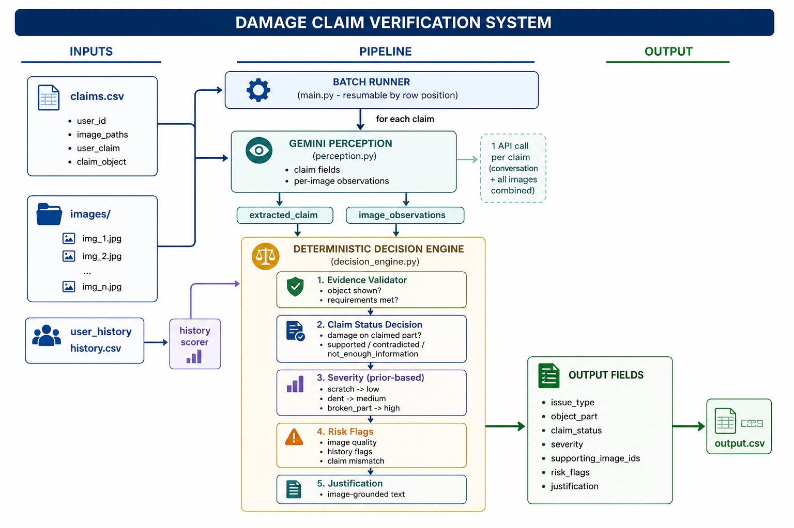

# HackerRank Orchestrate

Starter repository for the **HackerRank Orchestrate** 24-hour hackathon.

Build a system that verifies visual evidence for damage claims across three object types: **cars**, **laptops**, and **packages**.

Your system will receive claim conversations, one or more submitted images, user claim history, and minimum evidence requirements. It must decide whether the submitted images support the claim, contradict it, or do not provide enough information.

Read [`problem_statement.md`](./problem_statement.md) for the full task spec, input/output schema, and allowed values.

---

## Contents

1. [Repository layout](#repository-layout)
2. [What you need to build](#what-you-need-to-build)
3. [Where your code goes](#where-your-code-goes)
4. [Quickstart](#quickstart)
5. [Evaluation](#evaluation)
6. [Chat transcript logging](#chat-transcript-logging)
7. [Submission](#submission)
8. [Judge interview](#judge-interview)

---

## Repository layout

```text
.
├── AGENTS.md                         # Rules for AI coding tools + transcript logging
├── problem_statement.md              # Full task description and I/O schema
├── README.md                         # You are here
├── code/                             # Build your solution here
│   ├── main.py                       # Entry point (batch or debug mode)
│   ├── perception.py                 # Gemini perception: one call per claim
│   ├── decision_engine.py            # Deterministic claim decision logic
│   ├── gemini_client.py              # Gemini API wrapper + content-based caching
│   ├── mappings.py                   # Domain label canonicalization
│   ├── evidence_validator.py         # Evidence requirement checks
│   ├── history_scorer.py             # User history risk lookup
│   ├── claim_extractor.py            # Fallback claim extraction
│   ├── image_analyzer.py             # Fallback per-image analysis
│   └── evaluation/
│       ├── main.py                   # Evaluation framework
│       └── evaluation_report.md      # Strategy comparison and metrics
├── dataset/
│   ├── sample_claims.csv             # Inputs + expected outputs for development
│   ├── claims.csv                    # Inputs only; run your system on these rows
│   ├── user_history.csv              # Historical claim counts and risk context
│   ├── evidence_requirements.csv     # Minimum image evidence requirements
│   └── images/
│       ├── sample/                   # Images referenced by sample_claims.csv
│       └── test/                     # Images referenced by claims.csv
└── output.csv                        # Predictions for all rows in dataset/claims.csv
```

## Architecture

<p align="center">
  
</p>

The system processes damage claims in batches, analyzes claim images using Gemini Vision, enriches results with user history, and uses a deterministic decision engine to generate claim verification outputs.

---

## What you need to build

A system that, for each row in `dataset/claims.csv`, produces one row in `output.csv`.

Input fields:

| Column | Meaning |
|-------|---------|
| `user_id` | User submitting the claim; use this to look up `dataset/user_history.csv` |
| `image_paths` | One or more submitted image paths, separated by semicolons |
| `user_claim` | Chat transcript describing the issue |
| `claim_object` | `car`, `laptop`, or `package` |

Required output fields:

| Column | Meaning |
|-------|---------|
| `user_id` | User submitting the claim |
| `image_paths` | Semicolon-separated image paths |
| `user_claim` | Full claim conversation |
| `claim_object` | Object type (car, laptop, package) |
| `evidence_standard_met` | Whether evidence meets requirements |
| `evidence_standard_met_reason` | Reason for the evidence decision |
| `risk_flags` | Semicolon-separated risk flags, or `none` |
| `issue_type` | Visible issue type |
| `object_part` | Relevant object part |
| `claim_status` | `supported`, `contradicted`, or `not_enough_information` |
| `claim_status_justification` | Concise explanation grounded in the image evidence |
| `supporting_image_ids` | Image IDs supporting the decision, or `none` |
| `valid_image` | Whether image set is usable for automated review |
| `severity` | `none`, `low`, `medium`, `high`, or `unknown` |

Hard requirements:

- Must read the provided CSV files and local images.
- Must produce `output.csv` with the exact schema in `problem_statement.md`.
- Must include an evaluation workflow
- Must avoid hardcoded test labels or file-specific answers.

Beyond that you are free to bring your own approach: VLMs, LLMs, structured prompting, rule layers, batching, caching, evaluation pipelines, model comparison, or anything else.

---

## Where your code goes

All of your work belongs in [`code/`](./code/). The repo ships with empty starter files that you can grow into your full solution.

Suggested conventions:

- Put your main runnable solution in `code/main.py`
- Put evaluation code under `code/evaluation/`
- Write final predictions to `output.csv`

---

## Quickstart

Clone this repository:

```bash
git clone git@github.com:interviewstreet/hackerrank-orchestrate-june26.git
cd hackerrank-orchestrate-june26
```

Run the damage claim verification system:

```bash
# Process sample claims (20 claims)
python code/main.py --input dataset/sample_claims.csv --output output_sample.csv

# Process test claims (44 claims)
python code/main.py --input dataset/claims.csv --output output.csv

# Debug a single claim
python code/main.py --debug user_001 --input dataset/sample_claims.csv
```

Run evaluation to see system performance:

```bash
python code/evaluation/main.py output_sample.csv dataset/sample_claims.csv
```
